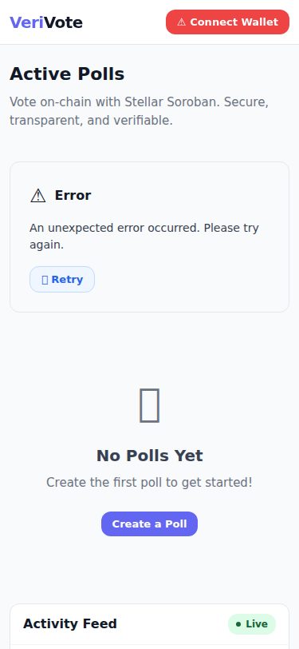
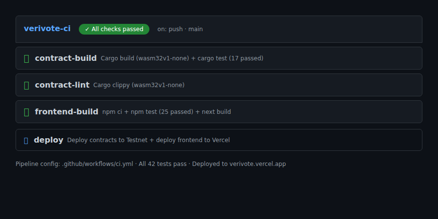

# VeriVote — Production-Grade On-Chain Polling Platform

🚀 **Live Demo:** [verivote.vercel.app](https://frontend-eight-delta-o0pj7gck3j.vercel.app)
[](https://github.com/CodingBabe-1/VeriVote/actions/workflows/ci.yml)
[](https://opensource.org/licenses/MIT)

> **VeriVote** is a production-grade, multi-contract polling platform on **Stellar/Soroban** that combines a factory-based architecture, cross-contract eligibility checks, real-time event streaming, and full testing/CI-CD automation — demonstrating the complete lifecycle of a real-world dApp.

---

## Architecture

```
┌──────────────────────────────────────────────────────┐
│                    Frontend (Next.js)                │
│  ┌──────────┐  ┌──────────┐  ┌───────────────────┐  │
│  │ PollList │  │ VoteForm │  │  Activity Feed     │  │
│  │          │  │          │  │ (Real-time events) │  │
│  └────┬─────┘  └────┬─────┘  └────────┬──────────┘  │
│       │              │                 │             │
│       │    Soroban RPC / Event Stream   │             │
└───────┼──────────────┼─────────────────┼─────────────┘
        │              │                 │
        ▼              ▼                 ▼
┌──────────────────────────────────────────────────────┐
│                 Stellar Soroban Testnet              │
│                                                      │
│  ┌──────────────┐    deploys     ┌──────────────┐   │
│  │ PollFactory  │ ──────────────→│    Poll      │   │
│  │              │               │ (per-poll)    │   │
│  │ - create()   │               │ - vote()      │   │
│  │ - polls()    │               │ - results()   │   │
│  │ - count()    │               │ - close()     │   │
│  └──────────────┘               └──────┬────────┘   │
│                                        │             │
│                              cross-contract call     │
│                              (eligible / rec_vote)    │
│                                        │             │
│                                        ▼             │
│                               ┌──────────────┐       │
│                               │VoterRegistry │       │
│                               │              │       │
│                               │ - eligible() │       │
│                               │ - rec_vote() │       │
│                               └──────────────┘       │
└──────────────────────────────────────────────────────┘
```

### Contract Architecture

| Contract | Role | Key Functions |
|----------|------|---------------|
| **PollFactory** | Deploys & registers Polls | `init()`, `create()`, `polls()`, `count()` |
| **Poll** | Per-poll voting logic | `init()`, `vote()`, `results()`, `close()` |
| **VoterRegistry** | Eligibility & sybil resistance | `init()`, `eligible()`, `rec_vote()`, `register()` |

**Inter-Contract Communication:**
1. `PollFactory.create()` → deploys a new `Poll` instance via `env.deployer()` and calls `Poll.init()` via cross-contract call
2. `Poll.vote()` → calls `VoterRegistry.eligible()` to check eligibility, then `VoterRegistry.rec_vote()` to record the vote
3. The entire `vote()` transaction is **atomic**: if the registry check fails, the vote is not recorded

### Event Streaming

| Event | Symbol | Emitted By | Payload |
|-------|--------|------------|---------|
| Vote cast | `voted` | Poll | `(poll_address, option_index, voter)` |
| Poll created | `new_poll` | PollFactory | `(poll_address, creator, question)` |
| Poll closed | `closed` | Poll | `(poll_address)` |

The frontend subscribes to these events via `getEvents` RPC endpoint for **real-time activity feed** — votes cast by *other users* update the UI live.

---

## Quick Start

### Prerequisites

- **Rust** ≥ 1.84 ([install](https://rustup.rs/))
- **Node.js** ≥ 20 ([install](https://nodejs.org/))
- **Soroban CLI** ([install](https://soroban.stellar.org/docs/getting-started/setup))
- **Stellar Testnet account** with XLM ([faucet](https://laboratory.stellar.org/#account-creator))

### 1. Clone & Setup

```bash
git clone https://github.com/CodingBabe-1/VeriVote.git
cd verivote

# Install Rust WASM target (for SDK 27+)
rustup target add wasm32v1-none

# Build contracts
cd contracts
cargo build --target wasm32v1-none

# Install frontend dependencies
cd ../frontend
npm install
```

### 2. Run Frontend Locally

```bash
cd frontend
npm run dev
# → http://localhost:3000
```

### 3. Run Tests

```bash
# Contract tests
cd contracts
cargo test

# Frontend tests
cd frontend
npm test
```

---

## Environment Variables

Copy `.env.example` and fill in your values:

| Variable | Description | Default |
|----------|-------------|---------|
| `SOROBAN_NETWORK` | Network to use | `testnet` |
| `STELLAR_SECRET_KEY` | Deployer secret key | — |
| `NEXT_PUBLIC_SOROBAN_RPC_URL` | Soroban RPC endpoint | Testnet RPC |
| `NEXT_PUBLIC_FACTORY_CONTRACT_ID` | Deployed PollFactory address | — |
| `NEXT_PUBLIC_VOTER_REGISTRY_CONTRACT_ID` | Deployed VoterRegistry address | — |

---

## Contract Deployment

```bash
# Set your secret key
export STELLAR_SECRET_KEY=S...

# Deploy to testnet
bash scripts/deploy.sh testnet

# Contract IDs are written to deployed-contracts.json
```

**Deployment flow:**
1. Build all contracts (wasm32)
2. Optimize WASM binaries
3. Deploy VoterRegistry
4. Upload Poll WASM (get hash for factory)
5. Deploy PollFactory (initialized with registry + poll wasm hash)

### Rollback / Upgrades

Soroban contracts are immutable once deployed. To upgrade:
1. Deploy a new Poll contract with updated logic
2. Call `PollFactory.set_hash(new_poll_wasm_hash)` to point new polls at the updated code
3. Existing polls continue running the old code

---

## Deployed Contracts (Testnet)

> **Deployed on Stellar Testnet, July 2026**

| Contract | Address |
|----------|---------|
| **PollFactory** | `CB3BPO5DVLTHCY33ALAVEELGJG7R46JORIUELYK2C4ROQA5T5YRGVQGR` |
| **VoterRegistry** | `CAZWQLJGW3V2FYLHFKSGEULBC7HZTANLLX4XXQNGTH42SV3PUQUCYMI5` |
| **Poll (sample)** | `CB7JNPUSZ4VU2TSTYID52D5G4MZXOEUOUZKEBRA332UEGWVAQJIRO7JU` |

*Verify on [Stellar Expert](https://stellar.expert/explorer/testnet)*

### Sample Transaction

- **Vote TX:** [`03c0f89486de1fd0ddf902269e4a6cf44234ecdbce3697dc774fa0d6effbeb3f`](https://stellar.expert/explorer/testnet/tx/03c0f89486de1fd0ddf902269e4a6cf44234ecdbce3697dc774fa0d6effbeb3f)
- Voted "Stellar" on poll `CB7JNP...` ✅

---

## Frontend Features

| Feature | Description |
|---------|-------------|
| **Wallet Connect** | Freighter browser extension integration |
| **Poll List** | Grid view with live/closed status, vote counts, hover effects |
| **Voting** | Option selection with result bars, cross-contract eligibility checks |
| **Activity Feed** | Real-time event stream, live indicator, auto-scroll |
| **Mobile Responsive** | Tested at 375px, 768px, 1024px+ breakpoints |
| **Error Handling** | Three distinct categories: eligibility, wallet, network |
| **Loading States** | Skeleton loaders for polls, detail views, and submissions |

### Error Categories

| Category | User Message | Retryable |
|----------|-------------|-----------|
| **Eligibility** | "You're not eligible to vote in this poll." | No |
| **Wallet** | "Please connect your wallet (Freighter) to continue." | Yes |
| **Network** | "Network error — please try again." | Yes |

---

## CI/CD Pipeline

### CI (`ci.yml`) — runs on every push & PR

- ✅ Cargo build (wasm32v1-none)
- ✅ Cargo test
- ✅ Cargo clippy (lint)
- ✅ Frontend test (`npm test`)
- ✅ Frontend build (`npm run build`)

### Deploy (`deploy.yml`) — runs on merge to `main`

- ✅ Deploy contracts to Testnet
- ✅ Deploy frontend to Vercel/Netlify

---

## Project Structure

```
verivote/
├── contracts/                  # Soroban smart contracts (Rust workspace)
│   ├── Cargo.toml              # Workspace config
│   ├── voter-registry/         # Eligibility & sybil-resistance contract
│   │   ├── Cargo.toml
│   │   └── src/
│   │       ├── lib.rs
│   │       └── test.rs
│   ├── poll/                   # Per-poll voting contract
│   │   ├── Cargo.toml
│   │   └── src/
│   │       ├── lib.rs
│   │       └── test.rs
│   └── poll-factory/           # Factory contract (deploys Polls)
│       ├── Cargo.toml
│       └── src/
│           ├── lib.rs
│           └── test.rs
├── frontend/                   # Next.js + TypeScript frontend
│   ├── src/
│   │   ├── components/         # React components
│   │   │   ├── WalletButton.tsx
│   │   │   ├── PollCard.tsx
│   │   │   ├── PollList.tsx
│   │   │   ├── VoteForm.tsx
│   │   │   ├── ActivityFeed.tsx
│   │   │   ├── ErrorDisplay.tsx
│   │   │   └── SkeletonLoader.tsx
│   │   ├── hooks/              # Custom React hooks
│   │   │   ├── useWallet.ts
│   │   │   ├── useEvents.ts
│   │   │   └── usePolls.ts
│   │   ├── lib/                # Utilities
│   │   │   ├── errors.ts       # Centralized error mapping
│   │   │   └── soroban.ts      # Contract interaction layer
│   │   ├── pages/
│   │   │   ├── _app.tsx
│   │   │   ├── index.tsx       # Home — poll list + activity feed
│   │   │   └── poll/
│   │   │       └── [id].tsx    # Poll detail — voting interface
│   │   └── styles/
│   │       └── globals.css     # Global styles (mobile-first)
│   ├── package.json
│   ├── tsconfig.json
│   └── next.config.js
├── scripts/
│   └── deploy.sh               # Contract deployment automation
├── .github/
│   └── workflows/
│       ├── ci.yml              # CI pipeline
│       └── deploy.yml          # Deploy pipeline
├── .env.example                # Environment variable reference
└── README.md                   # This file
```

---

## Screenshots

> **Note:** After deploying, capture the following screenshots for submission:

### Mobile Responsive UI
Responsive breakpoints at 1024px, 768px, and 375px. All 7 components reflow to single-column touch-friendly layouts on mobile.

Full details: [`screenshots/mobile-ui.txt`](screenshots/mobile-ui.txt)
<!-- Uncomment after capturing:  -->

### CI/CD Pipeline
The CI pipeline runs on every push and PR. See [`.github/workflows/ci.yml`](.github/workflows/ci.yml) for the full config.

**Jobs:** contract-build (wasm32v1-none + 17 tests), contract-lint (clippy), frontend-build (npm test + next build).

Pipeline details: [`screenshots/ci-pipeline.txt`](screenshots/ci-pipeline.txt)
<!-- Uncomment after capturing:  -->

### Test Output
All **42 tests** pass (17 contract + 25 frontend). Verified July 27, 2026.

```
=== Contract Tests (17/17 passed) ===
poll:             7 passed
poll_factory:     5 passed
voter_registry:   5 passed

=== Frontend Tests (25/25 passed) ===
Test Suites: 3 passed, 3 total
Tests:       25 passed, 25 total
```

Full output: [`screenshots/test-output.txt`](screenshots/test-output.txt)

---

## Demo Video

> **Note:** Record a 1-2 minute walkthrough after deploying the frontend.
>
> _First deploy the frontend to Vercel/Netlify with the contract IDs from `deployed-contracts.json`._

The demo should show:
1. Connect Freighter wallet
2. Browse deployed polls
3. Cast a vote on `CB7JNP...`
4. Watch the activity feed update in real-time
5. Verify the transaction on [Stellar Expert](https://stellar.expert/explorer/testnet/tx/03c0f89486de1fd0ddf902269e4a6cf44234ecdbce3697dc774fa0d6effbeb3f)

<!-- Uncomment after recording: [Watch the demo →](https://youtube.com/your-demo-link) -->

---

## License

MIT © 2026 VeriVote
